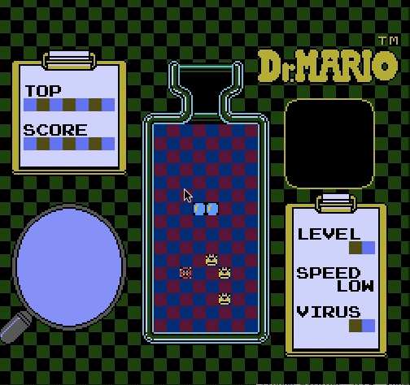

# Dr Mario
 
A simple game project to explore the Pygame framework.

Gameplay is functional, but there's much more I could do - adding audio, polishing visuals, exposing configuration options, adding proper start and end screens, and of course optimization. I'm sure I'll keep poking at it when I'm bored.  

**Requires:**  
Python 3.x  
Pygame  
 
**Controls:**  
← → ↓: move
SPACE: rotate
P: pause
ESC: quit  

Sprites from: https://www.spriters-resource.com/nes/drmario/
